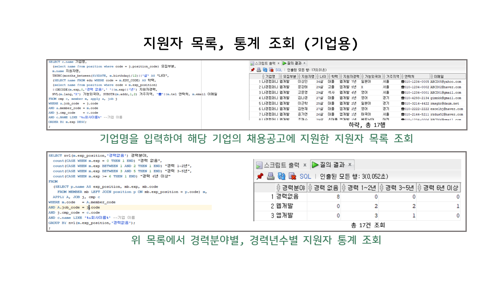
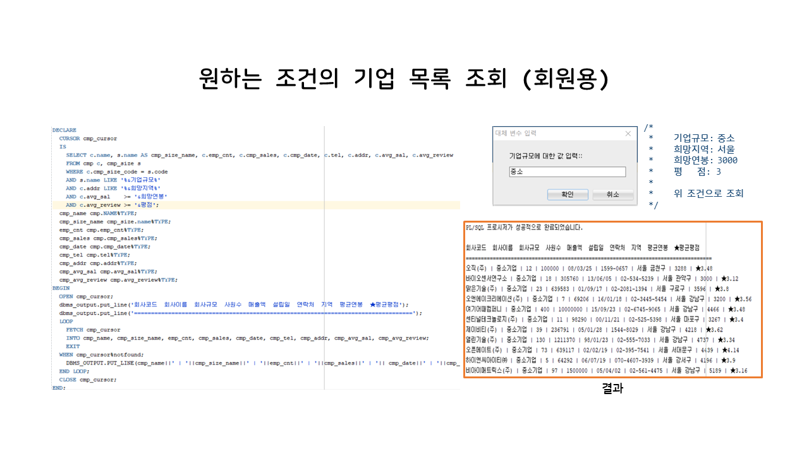
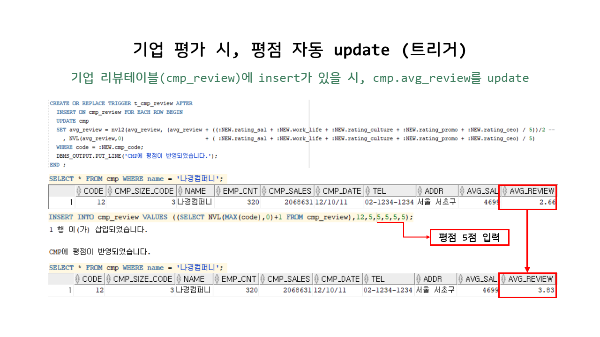
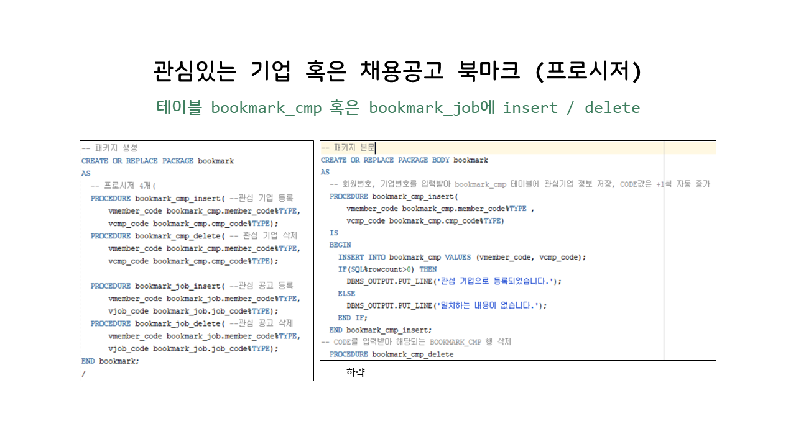
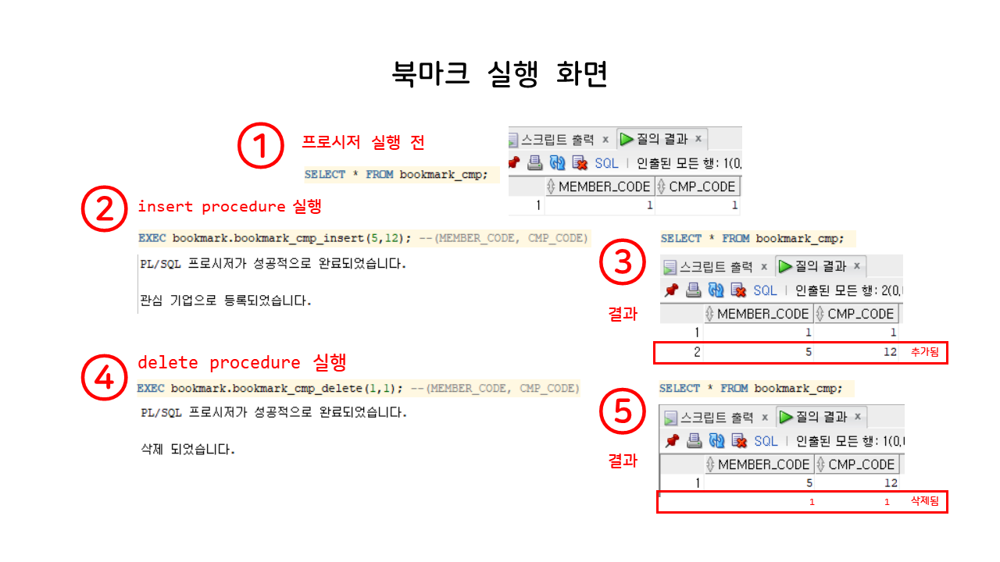
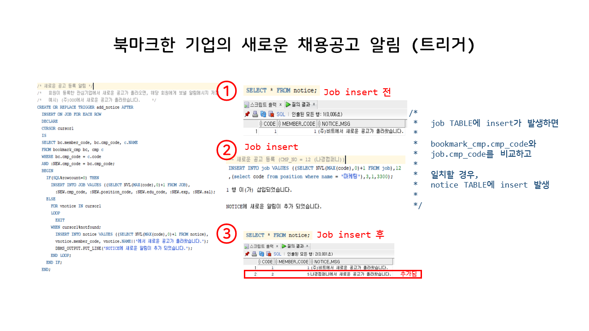
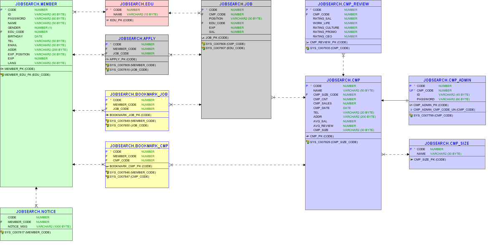
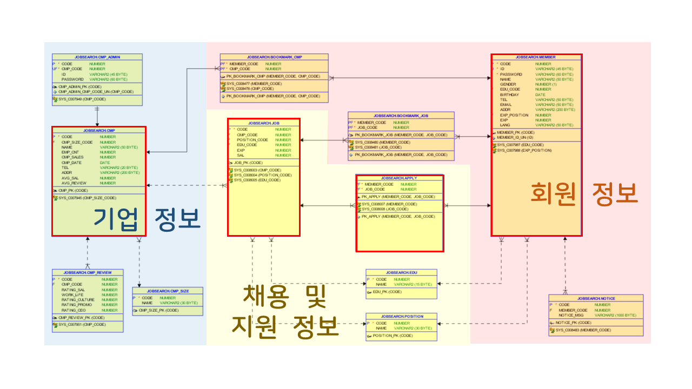

# JobSearchDB
Oracle DB Project
취업사이트 DB 구현
- 기간 : 2020. 07. 02 ~ 2020. 07. 14
- 개발툴 : Oracle sqldeveloper
- 주제 : 사람인, 잡코리아, 잡플래닛 등을 참고하여 데이터 모델링 및 DB 설계

&nbsp;&nbsp;&nbsp;

# Summary

기업 혹은 회원의 상세 조건 조회 (SQL, PL/SQL)

기업 평가 시, 평점 자동 update (Trigger)

관심있는 기업 혹은 채용공고 북마크 (Procedure)

북마크한 기업의 새로운 채용공고 알림 (Trigger)

&nbsp;&nbsp;&nbsp;

# DB Structure

